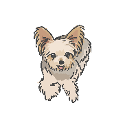

콩이와 함께하는 숫자 거꾸로 말하기 게임 -`૮◜o◝ ა

1. 숫자는 3초후 사라져요
2. 최대한 순서대로 읽고 머릿속으로 이미지를 만들어서 뒤집은 다음 통째로 입력하세요
3. 입력에 제한시간은 없으니 천천히 해도돼요
4. 숫자가 나와있는동안 거꾸로 읽고 그대로 입력하면 의미가 없습니다
5. 기억의 이미지화 트레이닝으로 기억력 향상에 도움이 되기위한 게임입니다

